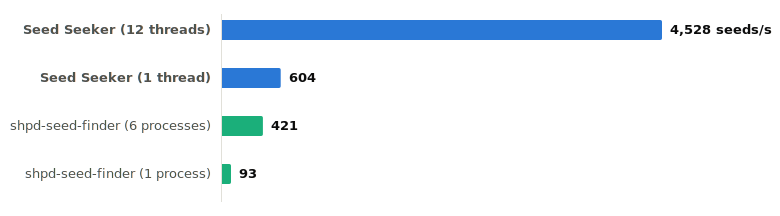

# Seed Seeker

[](https://github.com/akhial/shpd-seed-seeker/actions/workflows/ci.yml)
[](COPYING)

An extremely fast seed finder for [Shattered Pixel Dungeon](https://shatteredpixel.com/),
written in Rust — with native apps for Android, Linux, macOS, and Windows.

<p align="center">
  
</p>

<p align="center">
  <i>Scanning seeds for a +3 Wand of Fireblast across 24 floors, on an Apple M4 Pro (12 cores).
<p/>
<p align="center">
  See <a href="#benchmarks">Benchmarks</a> for the full methodology.</i>
</p>

- ⚡️ **16–30× faster** than the established Java seed finder
- 🔍 **Rich queries**: multiple requirements across melee and thrown weapons, armor, wands, and rings
- 🔮 **Seed scouting**: paste a seed code, get every item with floor, upgrade, enchantment, cursed state and source
- 📱 **Android app** beautiful Material 3 interface
- 🐧 **Native Linux app** GTK 4 and libadwaita
- 🍎 **Native macOS app** SwiftUI, Apple Silicon
- 🪟 **Native Windows app** WinUI 3, x64 and ARM64 using Fluent Design 2

## Table of contents

1. [Getting started](#getting-started)
1. [Search queries](#search-queries)
1. [Benchmarks](#benchmarks)
1. [Development](#development)
1. [Acknowledgements](#acknowledgements)
1. [License and identity](#license-and-identity)

## Getting started<a id="getting-started"></a>

### Download a release

Binaries are published on the [GitHub Releases page](https://github.com/akhial/shpd-seed-seeker/releases).

| Asset | Platforms |
| --- | --- |
| `seed-seeker-cli-<tag>-<target>.tar.gz` / `.zip` | CLI for Linux (x86_64, arm64), macOS (Apple Silicon, Intel), and Windows (x86_64, arm64) |
| `seed-seeker-<tag>-<arch>.AppImage` | Native Linux app (x86_64, arm64) |
| `seed-seeker-<tag>-macos-arm64.app.zip` | Native macOS app (Apple Silicon, macOS 14+) |
| `seed-seeker-<tag>-windows-<arch>.zip` | Native Windows app (x64, ARM64) |
| `seed-seeker-<tag>-android.apk` | Android app (arm64-v8a and x86_64) |

- The Windows app requires the
  [Windows App SDK 1.8 runtime](https://learn.microsoft.com/en-us/windows/apps/windows-app-sdk/downloads)
  to be installed.

### CLI

Build and run the benchmark:

```sh
cargo run --release -p shpd-seedfinder-cli -- --benchmark
cargo run --release -p shpd-seedfinder-cli -- -b 1000 --workers 4
```

To search, put the requirements in a JSON file and pass it with `--items` (or `-i`). Matching
seed codes are written to standard output in ascending order, starting from `AAA-AAA-AAA`:

```sh
cargo run --release -p shpd-seedfinder-cli -- --items requirements.json
cargo run --release -p shpd-seedfinder-cli -- -i requirements.json -b 1000 --workers 4
```

## Search queries<a id="search-queries"></a>

```jsonc
// ? optional · | alternatives · .. inclusive range · = default · ... repeat
{
  "max_depth"?: 1..24 = 24,
  "require_blacksmith"?: true | false = false,
  "exclude_blacksmith_rewards"?: true | false = false,
  "fast_mode"?: true | false = false,

  "challenges"?: [
    (
      "on_diet" | "faith_is_my_armor" | "pharmacophobia" | "barren_land" |
      "swarm_intelligence" | "into_darkness" | "forbidden_runes" |
      "hostile_champions" | "badder_bosses"
    ),
    ...
  ] = [],

  "requirements": [
    {
      // Supply "item", "kind", or both; when both are present they must agree.
      "kind"?: "weapon" | "armor" | "wand" | "ring",
      "item"?:
        // Weapons
        "worn_shortsword" | "cudgel" | "gloves" | "rapier" | "dagger" |
        "shortsword" | "hand_axe" | "spear" | "quarterstaff" | "dirk" | "sickle" |
        "sword" | "mace" | "scimitar" | "round_shield" | "sai" | "whip" |
        "longsword" | "battle_axe" | "flail" | "runic_blade" | "assassins_blade" |
        "crossbow" | "katana" | "greatsword" | "war_hammer" | "glaive" | "greataxe" |
        "greatshield" | "gauntlet" | "war_scythe" | "throwing_stone" |
        "throwing_knife" | "throwing_spike" | "fishing_spear" | "throwing_club" |
        "shuriken" | "throwing_spear" | "kunai" | "bolas" | "javelin" | "tomahawk" |
        "heavy_boomerang" | "trident" | "throwing_hammer" | "force_cube" | "rot_dart" |
        "incendiary_dart" | "adrenaline_dart" | "healing_dart" | "chilling_dart" |
        "shocking_dart" | "poison_dart" | "cleansing_dart" | "paralytic_dart" |
        "holy_dart" | "displacing_dart" | "blinding_dart" |
        // Armor
        "cloth_armor" | "leather_armor" | "mail_armor" | "scale_armor" | "plate_armor" |
        // Wands
        "wand_magic_missile" | "wand_fireblast" | "wand_frost" | "wand_lightning" |
        "wand_disintegration" | "wand_prismatic_light" | "wand_corrosion" |
        "wand_living_earth" | "wand_blast_wave" | "wand_corruption" | "wand_warding" |
        "wand_regrowth" | "wand_transfusion" |
        // Rings
        "ring_accuracy" | "ring_arcana" | "ring_elements" | "ring_energy" |
        "ring_evasion" | "ring_force" | "ring_furor" | "ring_haste" | "ring_might" |
        "ring_sharpshooting" | "ring_tenacity" | "ring_wealth",

      // Tier filters apply only to wildcard weapon/armor requirements.
      "tier"?:
        "any" |
        { "exact": 2..5 } |
        { "at_least": 3..4 } |
        { "at_most": 3..4 }
        = "any",

      // +4 is valid only for rings; "any" and effect names are case-insensitive.
      "upgrade"?:
        "any" | 1..3 | 4 |
        { "exact": 1..3 | 4 } |
        { "at_least": 0..3 | 4 }
        = "any",

      // The effect must belong to the selected weapon or armor kind.
      "effect"?:
        // Weapon enchantments
        "Blazing" | "Chilling" | "Kinetic" | "Shocking" | "Blocking" | "Blooming" |
        "Elastic" | "Lucky" | "Projecting" | "Unstable" | "Corrupting" | "Grim" |
        "Vampiric" |
        // Weapon curses
        "Annoying" | "Displacing" | "Dazzling" | "Explosive" | "Sacrificial" |
        "Wayward" | "Polarized" | "Friendly" |
        // Armor glyphs
        "Obfuscation" | "Swiftness" | "Viscosity" | "Potential" | "Brimstone" | "Stone" |
        "Entanglement" | "Repulsion" | "Camouflage" | "Flow" | "Affection" |
        "Anti-Magic" | "Thorns" |
        // Armor curses
        "Anti-Entropy" | "Corrosion" | "Displacement" | "Metabolism" | "Multiplicity" |
        "Stench" | "Overgrowth" | "Bulk",

      // true cannot be combined with a curse effect.
      "uncursed"?: true | false = false,
      "source"?:
        "heap" | "chest" | "locked_chest" | "crystal_chest" | "tomb" | "skeleton" |
        "sacrificial_fire" | "mimic" | "golden_mimic" | "crystal_mimic" | "statue" |
        "armored_statue" | "shop" | "ghost_reward" | "wandmaker_reward" |
        "blacksmith_reward" | "imp_reward",
      // Equal groups must resolve to the same kind and item ID.
      "identity_group"?: 1..255,
      "max_depth"?: 1..24 = query.max_depth
    },
    ...
  ]
}
```

### Fast Mode

This mode adds one lossy shortcut: +3 weapon/armor requirements consider only Ghost and Blacksmith rewards, skipping the rare Crypt and Sacrificial-fire prizes, so those searches end at floor 14.

## Benchmarks<a id="benchmarks"></a>

Compared with [Elektrochecker's Java finder](https://github.com/Elektrochecker/shpd-seed-finder):

| Configuration | Throughput | Relative |
| --- | ---: | ---: |
| Seed Seeker, 12 threads | 13,716 seeds/s | **30.3×** |
| Seed Seeker, 1 thread | 1,567 seeds/s | 16.7× (per core) |
| shpd-seed-finder, 6 processes (its best) | 453 seeds/s | 1× |
| shpd-seed-finder, 1 process | 94 seeds/s | — |

- **Machine:** Apple M4 Pro (12 cores), 48 GB, macOS 26.5
- **Query:** +3 Wand of Fireblast, 24 floors, seeds from `AAA-AAA-AAA`
- **Builds:** Shattered Pixel Dungeon v3.3.8; Rust release; Java OpenJDK 21
- **Samples:** Java 3,000–10,000; Rust 150,000 (1 thread), 1,000,000 (12 threads)
- **Java turbo:** 4/6/8 processes: 330/453/373 seeds/s
- **Cross-check:** identical 92 matches in the first 10,000 seeds
- **Planning:** exact shortcuts on; lossy `fast_mode` off
- **Depth 9 Java comparison:** 283 seeds/s; Seed Seeker is still 5.5× faster per core

Reproduce: `cargo run --release -p shpd-seedfinder-cli -- --benchmark`

## Development<a id="development"></a>

### Web app

Build the browser engine before starting Vite:

```sh
./scripts/build-web-wasm.sh && cd web && npm ci && npm run dev
```

Searches run fully client-side in Web Workers through WebAssembly. Release tags build and deploy the app to Firebase Hosting.

### Android

#### Building

```sh
cd android
JAVA_HOME=/path/to/java-21 ./gradlew :app:assembleRelease --offline
```

#### Signing

```sh
"$ANDROID_HOME/build-tools/36.1.0/apksigner" sign \
  --ks "$HOME/.android/debug.keystore" \
  --ks-pass pass:android --key-pass pass:android \
  --out seed-seeker-release-debug-signed.apk \
  android/app/build/outputs/apk/release/app-release-unsigned.apk
```

### macOS

#### Building

```sh
bash scripts/build-macos-native.sh
bash scripts/build-macos-app.sh
```

### Linux

The Linux app requires GTK 4.22, libadwaita 1.9, and `glib-compile-resources`;
[`linux/README.md`](linux/README.md) lists the development packages.

```sh
cargo run -p shpd-seedfinder-gtk
```

To build the AppImage on Fedora 44, install the packages from [`linux/README.md`](linux/README.md), plus `curl` and `file`, then run:

```sh
APPIMAGE_VERSION=dev bash scripts/build-linux-appimage.sh
./dist/seed-seeker-dev-"$(uname -m)".AppImage
```

### Testing

#### Rust

```sh
cargo test --workspace
cargo clippy --workspace --all-targets -- -D warnings
```

The workspace includes the GTK app, so the commands above need its system libraries (GTK 4.22 and libadwaita 1.9). Add `--exclude shpd-seedfinder-gtk` on macOS and Windows to exclude the GTK app from the test run.

#### Android

```sh
cd android
JAVA_HOME=/path/to/java-21 ./gradlew \
  :app:testDebugUnitTest \
  :app:lintDebug \
  :app:assembleRelease --offline
```

#### macOS

For the macOS app, build the Rust static library before running the Swift tests:

```sh
bash scripts/build-macos-native.sh
cd macos/SeedSeeker
swift test
```

#### Java Oracle


```sh
javac -d /tmp tooling/parity/RngOracle.java
java -cp /tmp RngOracle
```

`EquipmentOracle.java` is compiled against the isolated v3.3.8 JAR

## Acknowledgements<a id="acknowledgements"></a>

Seed Seeker reimplements the generation of
[Shattered Pixel Dungeon](https://github.com/00-Evan/shattered-pixel-dungeon) by Evan Debenham,
itself based on [Pixel Dungeon](https://github.com/watabou/pixel-dungeon) by Oleg Dolya.

[Elektrochecker's shpd-seed-finder](https://github.com/Elektrochecker/shpd-seed-finder) serves as an oracle for this project's parity tests.

## License and identity<a id="license-and-identity"></a>

This project is GPL-3.0-or-later. It contains a derived generation implementation and an unchanged item sprite atlas from Shattered Pixel Dungeon.

- Pixel Dungeon © 2012–2015 Oleg Dolya / Watabou
- Shattered Pixel Dungeon © 2014–2026 Evan Debenham
