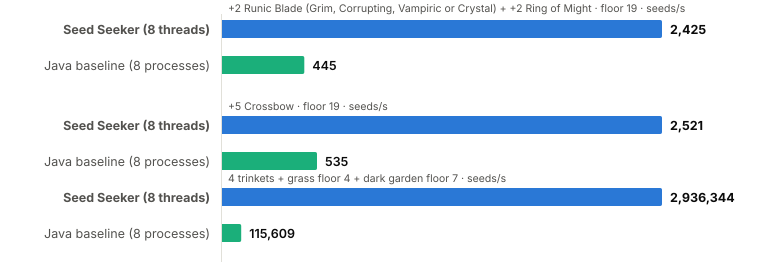

<p align="center">
  
</p>

<h1 align="center">Seed Seeker</h1>

<p align="center">
  <a href="https://github.com/akhial/shpd-seed-seeker/actions/workflows/ci.yml"></a>
  <a href="COPYING"></a>
</p>

An extremely fast seed finder for [Shattered Pixel Dungeon](https://shatteredpixel.com/),
written in Rust — with native apps for Android, Linux, macOS, and Windows.

**[Try it in your browser →](https://shpd-seed-seeker.web.app/)**

<p align="center">
  
</p>

<p align="center">
  <i>Matches/minute on AMD EPYC-Genoa (8) @ 2.25 GHz. The four-trinket row uses seeds/second.</i>
</p>

- ⚡️ **4.7–25.4× faster** than Java seed finders on the benchmark queries
- 🔍 **Rich queries**: multiple requirements across melee and thrown weapons, armor, wands, and rings
- 🔗 **Share links**: short links to share your search
- 📱 **Native apps** Material 3, GTK 4 and libadwaita, SwiftUI, WinUI 3

## Table of contents

1. [Getting started](#getting-started)
1. [Search queries](#search-queries)
1. [Benchmarks](#benchmarks)
1. [Development](#development)
1. [Acknowledgements](#acknowledgements)
1. [License and identity](#license-and-identity)

## Getting started<a id="getting-started"></a>

### Web app

Run searches directly at
[shpd-seed-seeker.web.app](https://shpd-seed-seeker.web.app/).

### Download a release

Binaries are published on the [GitHub Releases page](https://github.com/akhial/shpd-seed-seeker/releases).

| Asset | Platforms |
| --- | --- |
| `seed-seeker-cli-<tag>-<target>.tar.gz` / `.zip` | CLI for Linux (x86_64, arm64), macOS (Apple Silicon, Intel), and Windows (x86_64, arm64) |
| `seed-seeker-cli-<tag>-<target>-avx2.tar.gz` / `.zip` | CLI built for AVX2 x86-64 machines |
| `seed-seeker-<tag>-<arch>.AppImage` | Native Linux app (x86_64, arm64) |
| `seed-seeker-<tag>-macos-arm64.dmg` | Native macOS app (Apple Silicon, macOS 14+) |
| `seed-seeker-<tag>-windows-<arch>.zip` | Native Windows app (x64, ARM64) |
| `seed-seeker-<tag>-windows-x64-avx2.zip` | Windows app built for AVX2 x86-64 machines |
| `seed-seeker-<tag>-android-arm64-v8a.apk` | Android app for ARM64 phones and tablets |
| `seed-seeker-<tag>-android-x86_64.apk` | Android app for x86-64 devices and emulators |

- The Windows app requires the [Windows App SDK 1.8 runtime](https://learn.microsoft.com/en-us/windows/apps/windows-app-sdk/downloads).

### CLI

Build and run benchmark:

```sh
cargo run --release -p shpd-seedfinder-cli -- --benchmark
cargo run --release -p shpd-seedfinder-cli -- -b 1000 --workers 4
```

To search, put the requirements in a JSON file and pass it with `--items` (or `-i`):

```sh
cargo run --release -p shpd-seedfinder-cli -- --items requirements.json
cargo run --release -p shpd-seedfinder-cli -- -i requirements.json -b 1000 --workers 4
```

Searches and benchmarks start at `AAA-AAA-AAA` by default. Add `--random-start` to choose a random starting seed

```sh
seed-seeker --items requirements.json --random-start
```

Searches print one matching seed per line to stdout. Use `--output FILE` (or
`-o FILE`) to write those lines to a file, or add `--json` to export the query
and matches in the [shared results format](docs/results-export-format.md).

```sh
seed-seeker --items requirements.json --json --output results.json
```

Interactive searches print `Searching for N requirements...` once at startup.
This preamble is suppressed when stdout or stderr is piped or redirected, or
when `TERM=dumb`.

Press Ctrl+C to stop a search gracefully. On Unix, SIGTERM and SIGHUP also
request a graceful shutdown. The CLI waits for its workers, saves completed
matches, and prints time spent, average seeds/second, seeds searched, and
matches found to stderr. The same summary is printed when a search completes,
including when a JSON export reaches its result limit. Benchmarks also stop
gracefully and print their report for the seeds searched so far.
The summary starts on a fresh line after Ctrl+C and uses SHPD's title yellow,
white values, and Shattered green in terminals. Set `NO_COLOR=1` to
disable colors; redirected stderr and `TERM=dumb` remain plain text.
Seeds searched stays an integer below 100,000; larger counts use K, M, or B
with up to three decimal places (for example, `151 K` or `2.675 B`).

## Search queries<a id="search-queries"></a>

See the [search query format](docs/search-query-format.md) for the JSON
reference, Ring of Wealth farming floor filters, and blanket requirements.

## Benchmarks<a id="benchmarks"></a>

First two rows: **matching seeds per minute**, through floor 19. +2 Grim/Vampiric/Corrupting/Crystal Runic Blade and +2 Ring of Might.

| Query | Java baseline | AutoTrinket off | AutoTrinket on | AutoTrinket on / Java |
| --- | ---: | ---: | ---: | ---: |
| [+2 Runic Blade and +2 Ring of Might](https://shpd-seed-seeker.web.app/#q=QyAhKCsAAeAAAuoKAA) | 3.8 | 25.1 | **37.7** | 10× |
| +5 Crossbow | 779.3 | 3,633.9 | 3,639.5 | 4.7× |
| [Four trinkets; grass floor 4; dark garden floor 7 (seeds/s)](docs/four-trinket-java-benchmark.md) | 115,608.8 | — | **2,936,344.4** | 25.4× |

AutoTrinket improved match throughput by **50.4%**.

- **Machine:** AMD EPYC-Genoa (8) @ 2.25 GHz.

Reproduce:

```sh
tooling/benchmarks/run-linux.sh --minutes 10 --workers 8 --output /tmp/seed-seeker-benchmark
```

## Development<a id="development"></a>

### Web app

The web app is a [Vite+](https://viteplus.dev) project. Install `vp`
(`curl -fsSL https://vite.plus | bash`), then build the browser engine before starting the dev
server:

```sh
./scripts/build-web-wasm.sh && cd web && vp install && vp dev
```

### Android

#### Building

```sh
JAVA_HOME=/path/to/java-21 ./android/gradlew -p android :app:assembleRelease
```

Local builds include both supported architectures. Set `ANDROID_ABIS=arm64-v8a`
or `ANDROID_ABIS=x86_64` to build a smaller APK for one architecture, as release
CI does. Most supported phones and tablets use the `arm64-v8a` release download.

#### Signing

```sh
"$ANDROID_HOME/build-tools/36.1.0/apksigner" sign \
  --ks "$HOME/.android/debug.keystore" \
  --ks-pass pass:android --key-pass pass:android \
  --out seed-seeker-release-debug-signed.apk \
  android/app/build/outputs/apk/release/app-release-unsigned.apk
```

#### Installing

```sh
"$ANDROID_HOME/platform-tools/adb" devices -l
"$ANDROID_HOME/platform-tools/adb" install -r seed-seeker-release-debug-signed.apk
"$ANDROID_HOME/platform-tools/adb" shell monkey \
  -p dev.seedseeker.unofficial -c android.intent.category.LAUNCHER 1
```

### macOS

#### Building

```sh
bash scripts/build-macos-native.sh
bash scripts/build-macos-app.sh
```

#### PGO

```sh
rustup component add llvm-tools && bash scripts/record-pgo-profile.sh
```

### Linux

The Linux app requires GTK 4.22, libadwaita 1.9, and `glib-compile-resources`;
[`linux/README.md`](linux/README.md) lists the development packages.

```sh
cargo run -p shpd-seedfinder-gtk
```

To build the AppImage on Fedora 44, install the packages from [`linux/README.md`](linux/README.md), plus `curl` and `file`, then run:

```sh
APPIMAGE_VERSION=dev bash scripts/build-linux-appimage.sh
./dist/seed-seeker-dev-"$(uname -m)".AppImage
```

### Windows

The Windows app requires Visual Studio with the WinUI application development and .NET desktop development workloads, and the Rust MSVC target (`rustup target add aarch64-pc-windows-msvc`); [`windows/README.md`](windows/README.md) lists the development packages.

```powershell
.\scripts\build-windows-app.ps1
```

The script builds for the host architecture; pass `-Platform ARM64` or `-Platform x64` to cross-build, and `-Configuration Debug` for a debug build.

Pass `-EngineIsa avx2` to build the engine for x86-64-v3.

#### PGO

```sh
PGO_TARGET=x86_64-pc-windows-msvc bash scripts/record-pgo-profile.sh
```

### Testing

#### Rust

```sh
cargo test --workspace
cargo clippy --workspace --all-targets -- -D warnings
```

The workspace includes the GTK app, so the commands above need its system libraries (GTK 4.22 and libadwaita 1.9). Add `--exclude shpd-seedfinder-gtk` on macOS and Windows to exclude the GTK app from the test run.

#### Android

```sh
JAVA_HOME=/path/to/java-21 ./android/gradlew -p android \
  :app:testDebugUnitTest \
  :app:lintDebug \
  :app:assembleRelease
```

#### macOS

For the macOS app, build the Rust static library before running the Swift tests:

```sh
bash scripts/build-macos-native.sh
cd macos/SeedSeeker
swift test
```

## Acknowledgements<a id="acknowledgements"></a>

Seed Seeker reimplements the generation of
[Shattered Pixel Dungeon](https://github.com/00-Evan/shattered-pixel-dungeon) by Evan Debenham.

## License and identity<a id="license-and-identity"></a>

This project is GPL-3.0-or-later.

- Pixel Dungeon © 2012–2015 Oleg Dolya / Watabou
- Shattered Pixel Dungeon © 2014–2026 Evan Debenham
