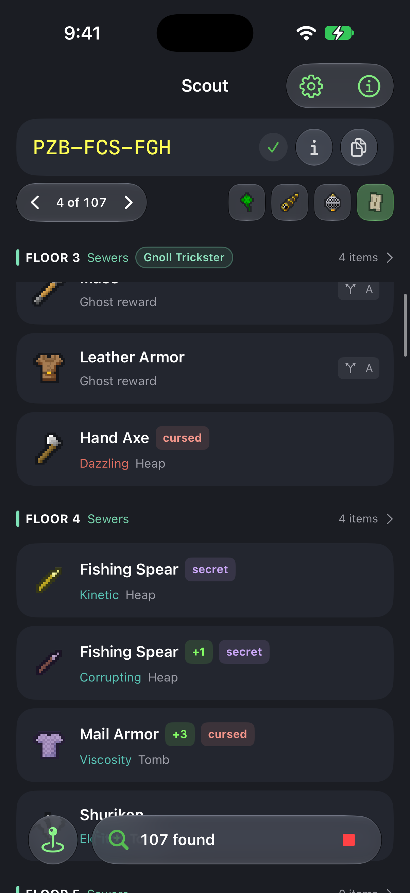
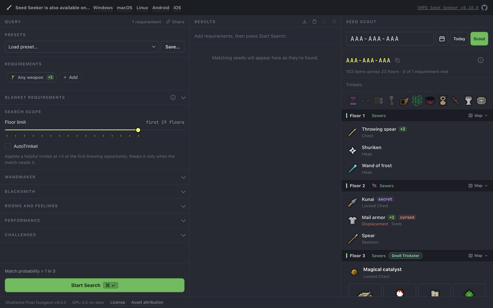

# Seed Seeker for iOS

Captured from the app on the iPhone 18 Pro simulator running iOS 27. The app
uses the real Rust engine; the status bar is normalized for these screenshots.

| Requirement board | Requirement editor |
| --- | --- |
|  |  |

| Search settings | Arcane Resin |
| --- | --- |
|  |  |

| Search results | Scout and trinkets |
| --- | --- |
|  |  |

| Seed information | Interactive map |
| --- | --- |
|  |  |

| Item selection | Scout during a search |
| --- | --- |
|  |  |

## Web downloads

The web top bar places iOS beside Android. Its iOS panel provides the IPA download
and links to the sideloading instructions.

